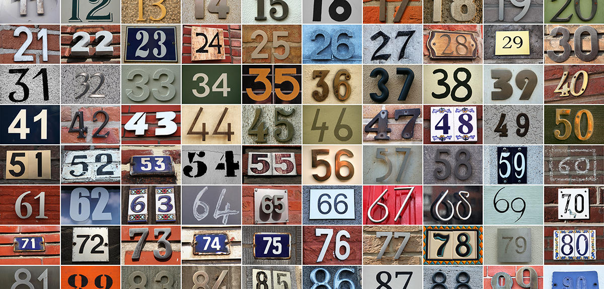

# Averagely

### This program calculates sum of any numbers

## Introduction to how we made the program
   ### What is used to operate the program

* This program includes several operations like if else, type conversation, loops etc 

### What can be done using this program
* Calculater can calculate the sum of any numbers in liniear fashion
* Calculater can calculate the sum of any numbers in non-liniear fashion
* Calculater asks you if it should continue to calculate or not

###  [You can find the source code of the program here](https://github.com/Aziz7574/CircleSurface/)

 

